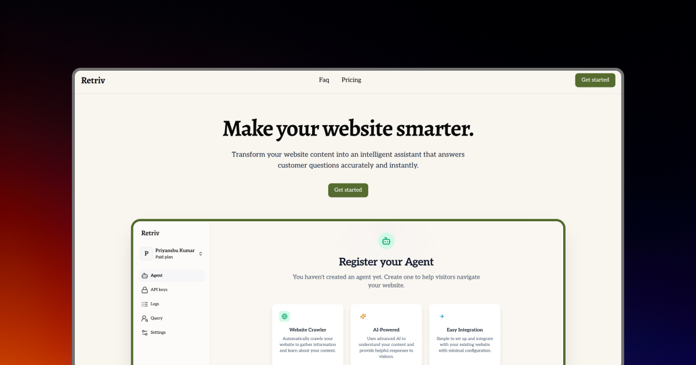

# **Retriv**

Retriv is a no-code platform that lets businesses create and embed their own AI agents in minutes. These agents can answer visitor questions by understanding and retrieving information from website content.

## **Features**

- Lets users register their AI agent by submitting their website URL.
- Automatically crawls and indexes the website pages content.
- Provides a embeddable frontend script to integrate the AI agent on any website.
- Supports chat-based interactions, with real-time streaming responses from the agent.
- Enables organizations to track and analyze agent usage, agent responses, performance and response accuracy.
- Includes conversation history, source-linked answers, and customizable agent settings.

## **Built With**

- **[Next.js](https://nextjs.org/)**
- **[Tailwind CSS](https://tailwindcss.com/)**
- **[Shadcn/UI](https://ui.shadcn.com/)**
- **[Node.js](https://nodejs.org/)**
- **[Express.js](https://expressjs.com/)**
- **[Python](https://www.python.org/)**
- **[Redis](https://redis.io/)**
- **[FastAPI](https://fastapi.tiangolo.com/)**
- **[Redis](https://redis.io/)**
- **[Prisma](https://www.prisma.io/)**
- **[PostgreSQL](https://www.postgresql.org/)**
- **[Qdrant](https://qdrant.tech/)**
- **[BeautifulSoup]()**

## **Demo**

 I embedded it on my portfolio website where you can see the agent being embedded and responding based on my website data.